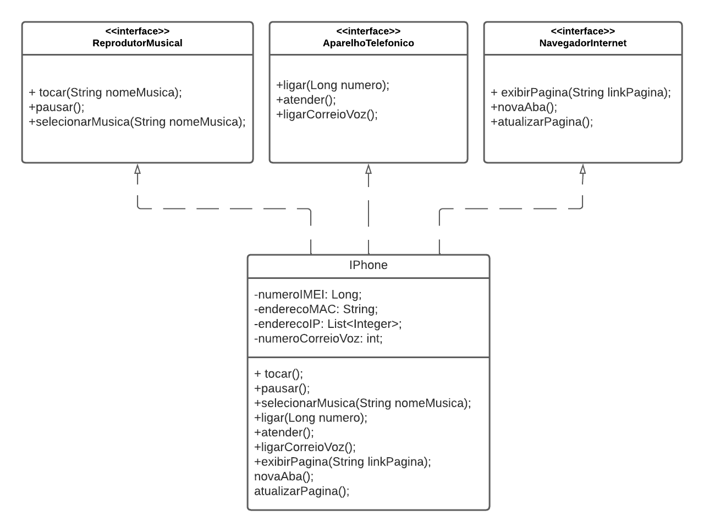

## Orientação a Objetos e UML: Diagramação de Classes do iPhone
Esse projeto visa exibir a diagramação da unificação das funções agrupadas num único aparelho que foi o iPhone.

Mediante seu lançamento, foram agragadas funções de diferentes aparelhos populares àquela época:
+ Player de Música
+ Web Browser 
+ Aparelho Telefônic

Esse projeto apresentamos um diagrama UML contendo a estrutura básica dessa abstração, 
bem como a implementação inicial desse diagrama utilizando da linguagem Java.

Trata-se de um projeto da disciplina 'Orientação a Objetos e UML: Diagramação de Classes do iPhone'
apresentada no bootcamp 'Coding The Future - GFT e AWS | Desenvolvimento Java com Cloud AWS', ministrada pelo
professor Gleyson Sampaio na plataforma da DIO.